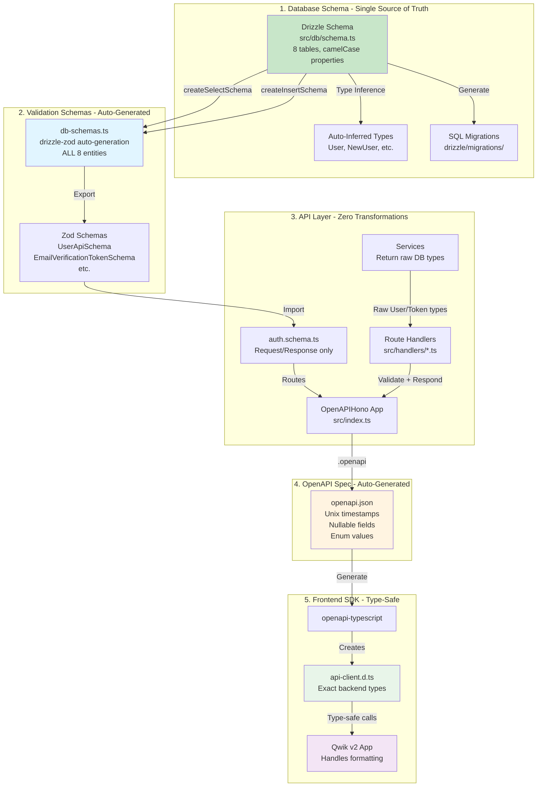
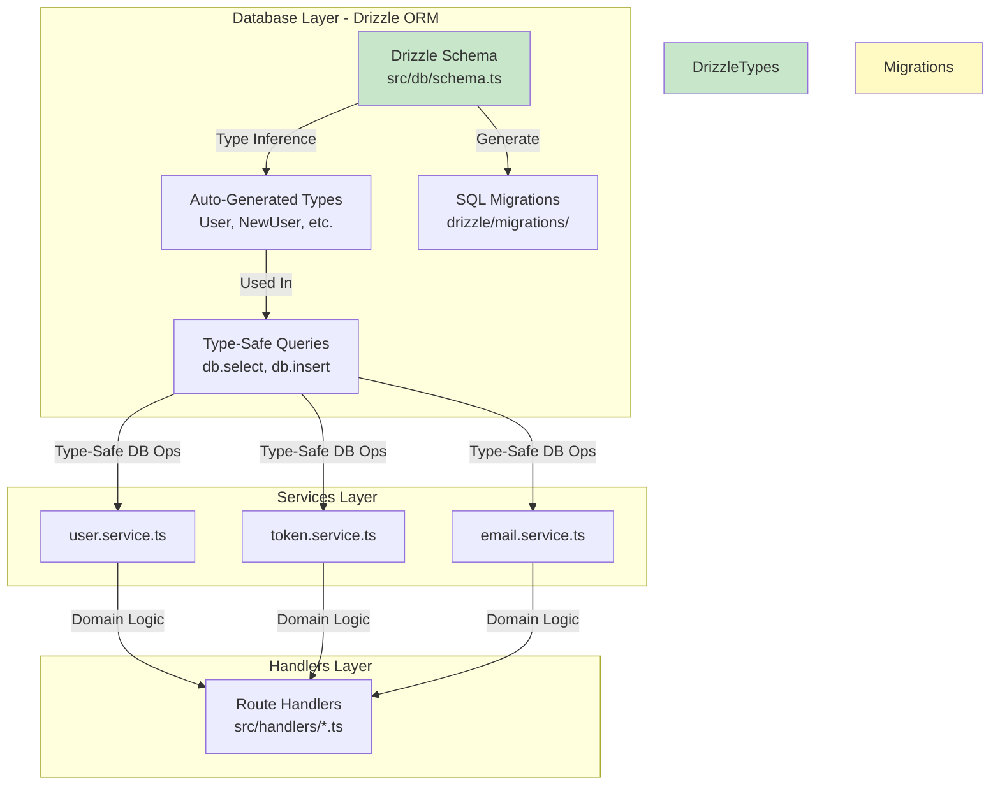
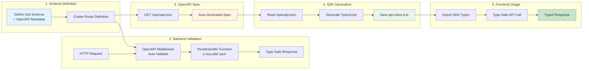
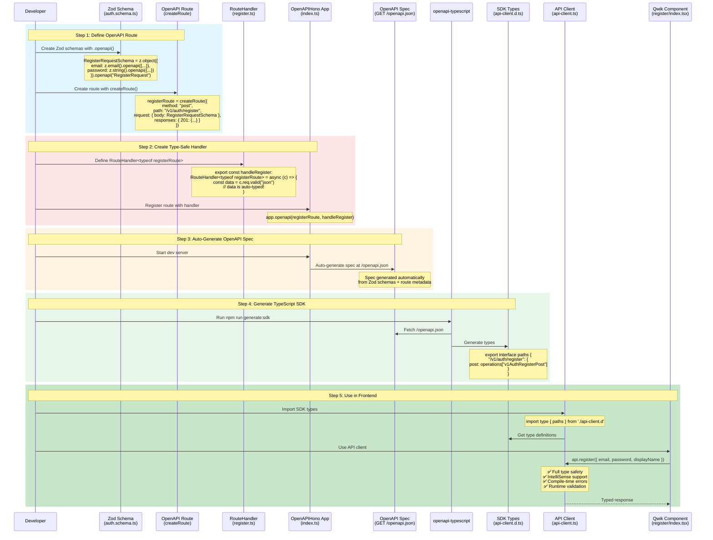
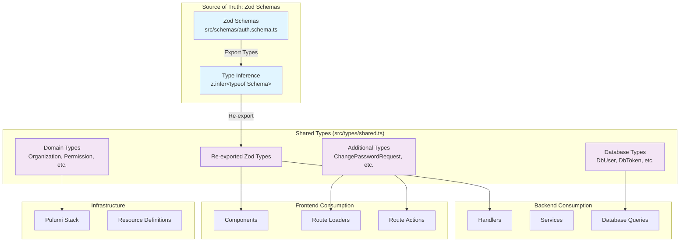
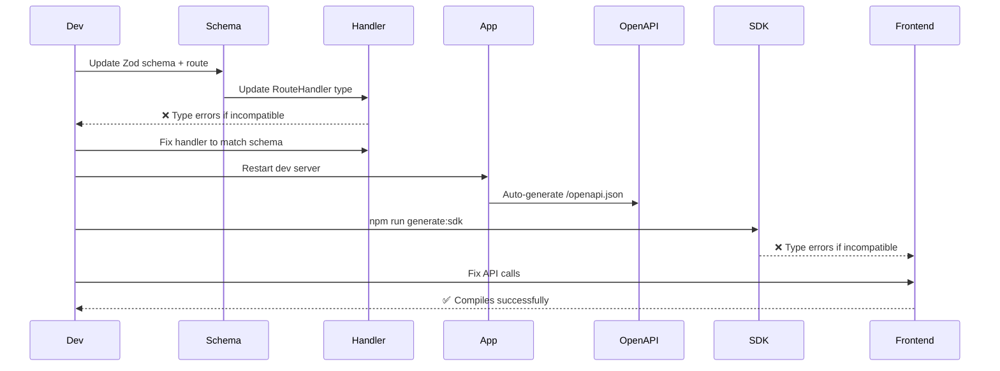

# Type System Architecture - Pure DRY

## Overview

This document describes the **Pure DRY (Don't Repeat Yourself) Architecture** used across the entire authentication service. The system achieves **maximum simplicity** by using the database schema as the single source of truth for both validation and API types.

**Core Principle**: Database schema IS the API schema. No transformations, no normalization, no drift.

**Achieved in Phase 3.6**: Complete elimination of transformation logic, consolidation of all entity schemas into a single file, and automatic Zod schema generation from Drizzle tables using `drizzle-zod`.

---

## Pure DRY Architecture Diagram



---

## Key Architectural Decisions

### 1. Database Schema IS the API Schema

**No transformation layer exists between database and API responses.**

```typescript
// ❌ OLD APPROACH (Phase 3.5 and earlier)
// Backend transforms data before sending to API
interface NormalizedUser {
  id: string;
  email: string;
  displayName: string; // Never null!
  createdAt: string; // ISO string!
  status: "active" | "suspended"; // Transformed from boolean!
}

function normalizeUser(dbUser: User): NormalizedUser {
  return {
    ...dbUser,
    displayName: dbUser.displayName || dbUser.email.split("@")[0],
    createdAt: new Date(dbUser.createdAt * 1000).toISOString(),
    status: dbUser.isActive ? "active" : "suspended",
  };
}

// ✅ NEW APPROACH (Phase 3.6 - Pure DRY)
// API returns exact database format
type User = {
  id: string;
  email: string;
  displayName: string | null; // Nullable!
  createdAt: number; // Unix timestamp!
  status: "active" | "suspended"; // Database enum!
};

function getUserData(dbUser: User): User {
  return dbUser; // No transformation! 🎉
}
```

### 2. drizzle-zod Auto-Generation

**All Zod schemas are auto-generated from Drizzle tables using `drizzle-zod` v0.8.3.**

```typescript
// ✅ src/schemas/db-schemas.ts
import { createSelectSchema, createInsertSchema } from "drizzle-zod";
import { users } from "../db/schema";

// Auto-generate Zod schema from Drizzle table
const BaseUserSchema = createSelectSchema(users);

// Pick public fields for API (excludes passwordHash)
export const UserApiSchema = BaseUserSchema.pick({
  id: true,
  email: true,
  displayName: true,
  avatarUrl: true,
  emailVerified: true,
  createdAt: true,
  updatedAt: true,
  lastLoginAt: true,
  status: true,
}).openapi("User");

// Type is automatically inferred
export type UserApi = z.infer<typeof UserApiSchema>;
```

### 3. Drizzle ORM Database Schema

**Phase 3.5 Achievement**: Migrated from manual SQL queries to **Drizzle ORM** for type-safe database operations.



### Schema Definition

**Location**: `src/db/schema.ts`

**Key Principles**:

- **camelCase properties** with **snake_case column names**
- **Unix timestamps** (seconds, not milliseconds)
- **Text enums** instead of booleans
- **Nullable fields** where appropriate

**Example**:

```typescript
import {
  sqliteTable,
  text,
  integer,
  index,
  uniqueIndex,
} from "drizzle-orm/sqlite-core";

export const users = sqliteTable(
  "users",
  {
    id: text("id").primaryKey(),
    email: text("email").notNull().unique(),
    passwordHash: text("password_hash"), // Nullable for OAuth-only accounts
    emailVerified: integer("email_verified", { mode: "boolean" })
      .notNull()
      .default(false),
    displayName: text("display_name"), // Nullable - no default value
    avatarUrl: text("avatar_url"), // Nullable - no default value
    createdAt: integer("created_at").notNull(), // Unix timestamp (seconds)
    updatedAt: integer("updated_at").notNull(), // Unix timestamp (seconds)
    lastLoginAt: integer("last_login_at"), // Nullable - no default value
    status: text("status", { enum: ["active", "suspended"] })
      .notNull()
      .default("active"),
  },
  (table) => [
    uniqueIndex("idx_users_email").on(table.email),
    index("idx_users_created_at").on(table.createdAt),
  ]
);

// ✨ Auto-generate types from schema
export type User = typeof users.$inferSelect;
export type NewUser = typeof users.$inferInsert;
```

### Type Inference

Drizzle automatically generates TypeScript types:

```typescript
// Automatically inferred - no manual definition needed!
type User = {
  id: string;
  email: string;
  passwordHash: string | null; // ← Nullable
  emailVerified: boolean;
  displayName: string | null; // ← Nullable
  avatarUrl: string | null; // ← Nullable
  createdAt: number; // ← Unix timestamp
  updatedAt: number; // ← Unix timestamp
  lastLoginAt: number | null; // ← Nullable
  status: "active" | "suspended"; // ← Enum
};

type NewUser = {
  id: string;
  email: string;
  passwordHash?: string | null;
  emailVerified?: boolean;
  displayName?: string | null;
  avatarUrl?: string | null;
  createdAt: number;
  updatedAt: number;
  lastLoginAt?: number | null;
  status?: "active" | "suspended";
};
```

---

## Pure DRY Benefits

### Code Reduction

| Metric                           | Before (Phase 3.5) | After (Phase 3.6) | Reduction |
| -------------------------------- | ------------------ | ----------------- | --------- |
| Schema files                     | 4 files            | 2 files           | -50%      |
| Lines in schemas/                | ~400 lines         | ~250 lines        | -37.5%    |
| Manual type definitions          | ~50 types          | 0 types           | -100%     |
| Transformation functions         | 8 functions        | 0 functions       | -100%     |
| normalizeUser() function         | 35 lines           | Deleted           | -100%     |
| Sources of truth for User schema | 3 (DB, Zod, Types) | 1 (DB only)       | -66%      |

### Type Safety

✅ **100% type coverage** - Database → API → Frontend  
✅ **Zero manual types** - All inferred from Drizzle schema  
✅ **Compile-time errors** - Invalid fields caught by TypeScript  
✅ **Auto-completion everywhere** - IntelliSense for all operations

---

## API Response Format

**Exact database format with no modifications:**

```json
{
  "id": "user_abc123",
  "email": "user@example.com",
  "displayName": null,
  "avatarUrl": null,
  "emailVerified": false,
  "createdAt": 1702425600,
  "updatedAt": 1702425600,
  "lastLoginAt": 1702530000,
  "status": "active"
}
```

**OpenAPI Type Definition (Auto-Generated)**:

```yaml
User:
  type: object
  properties:
    id:
      type: string
    email:
      type: string
    displayName:
      type: [string, null] # ← Nullable
    avatarUrl:
      type: [string, null] # ← Nullable
    emailVerified:
      type: boolean
    createdAt:
      type: integer # ← Unix timestamp
    updatedAt:
      type: integer
    lastLoginAt:
      type: [integer, null] # ← Nullable
    status:
      type: string
      enum: [active, suspended] # ← Database enum
```

---

## Old Type Inference Section

Drizzle automatically generates TypeScript types from schema definitions:

```typescript
// Automatically inferred - no manual definition needed!
type User = {
  id: string;
  email: string;
  password_hash: string | null;
  email_verified: boolean;
  display_name: string | null;
  avatar_url: string | null;
  created_at: number;
  updated_at: number;
  last_login_at: number | null;
  is_active: boolean;
};

type NewUser = {
  id: string;
  email: string;
  password_hash?: string | null;
  email_verified?: boolean;
  display_name?: string | null;
  avatar_url?: string | null;
  created_at: number;
  updated_at: number;
  last_login_at?: number | null;
  is_active?: boolean;
};
```

### Type-Safe Queries

**Before (Manual SQL)**:

```typescript
// ❌ No type safety, manual type assertions
const user = (await db
  .prepare("SELECT * FROM users WHERE id = ?")
  .bind(userId)
  .first()) as User | null;
```

**After (Drizzle ORM)**:

```typescript
// ✅ Fully type-safe, auto-completed
import { eq } from "drizzle-orm";
import * as schema from "./db/schema";

const user = await db
  .select()
  .from(schema.users)
  .where(eq(schema.users.id, userId))
  .get(); // Type: User | undefined (auto-inferred!)

// ✅ Insert with type checking
await db.insert(schema.users).values({
  id: generateId(),
  email: "test@example.com",
  created_at: Math.floor(Date.now() / 1000),
  updated_at: Math.floor(Date.now() / 1000),
  is_active: true,
  // ✅ TypeScript ensures all required fields are present
  // ✅ TypeScript catches invalid field names
  // ✅ TypeScript validates field types
});
```

### Migration Workflow

**Generate migrations from schema**:

```bash
# 1. Update src/db/schema.ts
# 2. Generate SQL migration
pnpm drizzle-kit generate

# Output: drizzle/migrations/0000_xxxx.sql
```

**Apply migrations**:

```bash
# Local development
wrangler d1 execute DB --local --file=drizzle/migrations/0000_xxxx.sql

# Production
wrangler d1 migrations apply DB --remote
```

### Benefits

✅ **100% type safety** - All database operations are type-checked  
✅ **Auto-completion** - IntelliSense for all queries  
✅ **Zero manual types** - Types inferred from schema  
✅ **Migration generation** - SQL migrations auto-generated from schema changes  
✅ **Single source of truth** - Schema defines both structure and types  
✅ **Compile-time errors** - Invalid queries caught before runtime  
✅ **~335 lines removed** - Eliminated manual queries and duplicate types

### Tables Defined

1. **users** - User accounts (with `display_name`, `avatar_url`)
2. **emailVerificationTokens** - Email verification tokens
3. **passwordResetTokens** - Password reset tokens
4. **refreshTokens** - JWT refresh tokens
5. **organizations** - Top-level organizational units (Phase 4+)
6. **teams** - Subgroups within organizations (Phase 4+)
7. **oauthProviders** - OAuth provider integrations (Phase 6)
8. **auditLog** - Security audit trail (Phase 7)

---

## Type Flow Diagram



---

## OpenAPI Generation & Consumption Workflow



---

## Layer-by-Layer Breakdown

### 1. Zod Schemas with OpenAPI Metadata (Single Source of Truth)

**Location**: `src/schemas/auth.schema.ts`

**Purpose**: Define validation rules, OpenAPI metadata, route definitions, and type inference

**Example**:

```typescript
import { z } from "zod";
import { createRoute } from "@hono/zod-openapi";
import { extendZodWithOpenApi } from "@asteasolutions/zod-to-openapi";

// Extend Zod with OpenAPI support
extendZodWithOpenApi(z);

// Define schemas with OpenAPI metadata
export const RegisterRequestSchema = z
  .object({
    email: z.string().email().openapi({
      description: "User email address",
      example: "user@example.com",
    }),
    password: z
      .string()
      .min(8, "Password must be at least 8 characters")
      .openapi({
        description:
          "User password (min 8 chars, must include uppercase, lowercase, number, special char)",
        example: "SecurePass123!",
      }),
    displayName: z.string().min(1, "Display name is required").openapi({
      description: "User display name",
      example: "johndoe",
    }),
  })
  .openapi("RegisterRequest");

export const RegisterResponseSchema = z
  .object({
    message: z.string().openapi({
      description: "Success message",
      example: "Registration successful",
    }),
    user: z.object({
      id: z
        .string()
        .openapi({ example: "550e8400-e29b-41d4-a716-446655440000" }),
      email: z.string().email().openapi({ example: "user@example.com" }),
      displayName: z.string().openapi({ example: "johndoe" }),
    }),
    accessToken: z.string().openapi({
      description: "JWT access token",
      example: "eyJhbGciOiJIUzI1NiIsInR5cCI6IkpXVCJ9...",
    }),
  })
  .openapi("RegisterResponse");

// Create OpenAPI route definition
export const registerRoute = createRoute({
  operationId: "v1AuthRegisterPost",
  method: "post",
  path: "/v1/auth/register",
  tags: ["Authentication"],
  summary: "Register a new user",
  description: "Create a new user account with email and password",
  security: [], // No auth required
  request: {
    body: {
      content: {
        "application/json": {
          schema: RegisterRequestSchema,
        },
      },
    },
  },
  responses: {
    201: {
      content: {
        "application/json": {
          schema: RegisterResponseSchema,
        },
      },
      description: "User registered successfully",
    },
    400: {
      content: {
        "application/json": {
          schema: ErrorResponseSchema,
        },
      },
      description: "Validation error or user already exists",
    },
  },
});

// ✨ Infer TypeScript types from Zod schemas
export type RegisterRequest = z.infer<typeof RegisterRequestSchema>;
export type RegisterResponse = z.infer<typeof RegisterResponseSchema>;
```

**Type Inference Output**:

```typescript
// Automatically inferred - no manual definition needed!
type RegisterRequest = {
  email: string;
  password: string;
  displayName: string;
};

type RegisterResponse = {
  message: string;
  user: {
    id: string;
    email: string;
    displayName: string;
  };
  accessToken: string;
};
```

**Benefits**:

- ✅ Runtime validation AND types from one definition
- ✅ OpenAPI metadata embedded in schemas
- ✅ Types automatically stay in sync with validation rules
- ✅ Detailed error messages from schema
- ✅ Single source of truth - change once, updates everywhere
- ✅ Auto-generated OpenAPI spec at runtime

---

### 2. Route Handlers (Type-Safe Business Logic)

**Location**: `src/handlers/*.ts`

**Purpose**: Process requests with pre-validated, auto-typed data

**Example**:

```typescript
import type { RouteHandler } from "@hono/zod-openapi";
import type { Env } from "../types";
import { registerRoute } from "../schemas/auth.schema";
import { registerUser } from "../services/user.service";

/**
 * Handle user registration
 * Data is pre-validated by OpenAPI middleware
 */
export const handleRegister: RouteHandler<
  typeof registerRoute,
  { Bindings: Env }
> = async (c) => {
  // Get pre-validated data from OpenAPI middleware
  // ✅ Fully typed based on registerRoute's request schema
  const data = c.req.valid("json");

  // data.email      ✅ Type: string (auto-validated as email)
  // data.password   ✅ Type: string (auto-validated min 8 chars)
  // data.displayName ✅ Type: string (auto-validated not empty)

  // Register user
  const result = await registerUser(data, c.env);

  // Return response matching OpenAPI schema
  // ✅ TypeScript ensures response matches RegisterResponseSchema
  return c.json(
    {
      message: "Registration successful",
      user: {
        id: result.user.id,
        email: result.user.email,
        displayName: result.user.display_name,
      },
      accessToken: result.accessToken,
    },
    201 // ✅ Must match status code defined in route
  );
};
```

**Key Improvements**:

- ✅ **No manual validation** - OpenAPI middleware handles it
- ✅ **Auto-typed data** - `c.req.valid("json")` returns typed data
- ✅ **Type-safe responses** - Return type must match route definition
- ✅ **RouteHandler type** - Links handler to specific route for full type safety

---

### 3. OpenAPI Specification (Auto-Generated)

**Location**: `GET /openapi.json` (runtime endpoint)

**Purpose**: API documentation and contract, generated automatically from Zod schemas

**Generated By**: OpenAPIHono app at runtime

**Example Output**:

```json
{
  "openapi": "3.1.0",
  "paths": {
    "/v1/auth/register": {
      "post": {
        "summary": "Register a new user",
        "requestBody": {
          "content": {
            "application/json": {
              "schema": {
                "type": "object",
                "properties": {
                  "email": { "type": "string", "format": "email" },
                  "password": { "type": "string", "minLength": 8 },
                  "displayName": { "type": "string" }
                },
                "required": ["email", "password", "displayName"]
              }
            }
          }
        },
        "responses": {
          "200": {
            "content": {
              "application/json": {
                "schema": {
                  "type": "object",
                  "properties": {
                    "message": { "type": "string" },
                    "user": { "$ref": "#/components/schemas/User" }
                  }
                }
              }
            }
          }
        }
      }
    }
  }
}
```

---

### 4. Generated TypeScript SDK

**Location**: `demo-app/src/lib/api-client.d.ts`

**Generated By**: `openapi-typescript`

**Example Output**:

```typescript
export interface paths {
  "/v1/auth/register": {
    post: {
      requestBody: {
        content: {
          "application/json": {
            email: string;
            password: string;
            displayName: string;
          };
        };
      };
      responses: {
        200: {
          content: {
            "application/json": {
              message: string;
              user: {
                id: string;
                email: string;
                displayName: string;
              };
            };
          };
        };
        400: {
          content: {
            "application/json": {
              error: string;
              message: string;
            };
          };
        };
      };
    };
  };
}
```

---

### 5. Type-Safe API Client

**Location**: `demo-app/src/lib/api-client.ts`

**Purpose**: Provide type-safe API methods

**Example**:

```typescript
import createClient from "openapi-fetch";
import type { paths } from "./api-client.d";

// Create typed client
export const apiClient = createClient<paths>({
  baseUrl: getApiUrl(),
});

// Type-safe API methods
export const api = {
  async register(data: {
    email: string;
    password: string;
    displayName: string;
  }) {
    const response = await apiClient.POST("/v1/auth/register", {
      body: data, // ✅ Type-checked
    });

    // response.data ✅ Typed automatically
    // response.error ✅ Typed automatically

    return handleApiResponse(response);
  },
};
```

**Benefits**:

- ✅ Full IntelliSense support
- ✅ Compile-time type checking
- ✅ Automatic response typing
- ✅ Error type safety

---

### 6. Qwik Route Actions (Frontend Validation)

**Location**: `demo-app/src/routes/**/*.tsx`

**Purpose**: Client-side validation and server actions

**Example**:

```typescript
import { routeAction$, z, zod$ } from "@qwik.dev/router";
import { api } from "~/lib/api-client";

export const useRegister = routeAction$(
  async (data, { fail }) => {
    try {
      const result = await api.register({
        email: data.email, // ✅ Type-checked
        password: data.password, // ✅ Type-checked
        displayName: data.displayName, // ✅ Type-checked
      });

      return { success: true, user: result.user };
    } catch (error) {
      return fail(400, { message: error.message });
    }
  },
  zod$({
    email: z.string().email("Invalid email"),
    password: z.string().min(8, "Password too short"),
    displayName: z.string().min(1, "Display name required"),
  })
);
```

**Benefits**:

- ✅ Client-side validation before API call
- ✅ Server-side execution (security)
- ✅ Automatic error handling
- ✅ Type-safe form data

---

## Shared Types System



**Location**: `src/types/shared.ts`

**Purpose**: Re-export Zod-inferred types + additional domain models

**Architecture**: Zod schemas are the **single source of truth**

**Key Type Categories**:

1. **Zod-Inferred Types** (re-exported):
   - `User`, `RegisterRequest`, `LoginResponse`, etc.
   - Generated automatically from `src/schemas/auth.schema.ts`
   - Always in sync with runtime validation
2. **Additional API Types**:
   - `ChangePasswordRequest` - Not yet in OpenAPI schema
   - Types for endpoints not yet migrated to Zod
3. **Domain Models** (Phase 4+):
   - `Organization`, `Team`, `Repository`
   - `Permission`, `Role`, `PermissionBitmap`
   - `OAuthAccount`, `OAuthProvider`
4. **Internal Types**:
   - `DbUser`, `DbRefreshToken` - Database schemas
   - `AccessTokenPayload`, `RefreshTokenPayload` - JWT internals
   - `Env` - Cloudflare Worker bindings

**Example Flow**:

```typescript
// 1. Define Zod schema (single source of truth)
// src/schemas/auth.schema.ts
export const LoginRequestSchema = z.object({
  email: z.email(),
  password: z.string(),
});

// 2. Infer TypeScript type from Zod
export type LoginRequest = z.infer<typeof LoginRequestSchema>;

// 3. Re-export in shared types
// src/types/shared.ts
export type { LoginRequest } from "../schemas/auth.schema";

// 4. Use in backend
// src/handlers/login.ts
import type { LoginRequest } from "../types/shared";
const data: LoginRequest = LoginRequestSchema.parse(body);

// 5. Use in frontend
// demo-app/src/routes/index.tsx
import type { LoginRequest } from "@/types/shared";
const credentials: LoginRequest = { email, password };
```

**Benefits**:

- ✅ **Single source of truth** - Zod schemas define both validation and types
- ✅ **Zero drift** - Types automatically match validation rules
- ✅ **Type inference** - No manual type definitions needed
- ✅ **Compile-time safety** - Breaking changes caught immediately

---

## Type Safety Guarantees

### Compile-Time Safety

```typescript
// ❌ This will NOT compile
const response = await api.register({
  email: "test@example.com",
  password: "weak", // ❌ Type error: missing uppercase, number, etc.
  wrongField: "oops", // ❌ Type error: unknown property
});

// ✅ This will compile
const response = await api.register({
  email: "test@example.com",
  password: "Test123!@#",
  displayName: "Test User",
});

// response.data.user.email ✅ Typed as string
// response.data.user.id    ✅ Typed as string
// response.data.user.age   ❌ Type error: property doesn't exist
```

### Runtime Safety

```typescript
// Backend validation with Zod
const data = registerSchema.parse(requestBody);
// ✅ If this succeeds, data is guaranteed to match schema
// ✅ If this fails, detailed error messages are returned

// Frontend validation with Qwik
zod$({
  email: z.string().email("Invalid email"),
  password: z.string().min(8, "Too short"),
});
// ✅ Validates before action runs
// ✅ Populates fieldErrors automatically
```

---

## Development Workflow

### When Creating a New Endpoint

1. **Define Zod Schemas with OpenAPI Metadata** (`src/schemas/auth.schema.ts`):

   ```typescript
   export const MyNewRequestSchema = z
     .object({
       field1: z.string().openapi({ description: "Field 1" }),
       field2: z.number().openapi({ description: "Field 2" }),
     })
     .openapi("MyNewRequest");

   export const MyNewResponseSchema = z
     .object({
       result: z.string(),
     })
     .openapi("MyNewResponse");

   export const myNewRoute = createRoute({
     operationId: "v1MyNewPost",
     method: "post",
     path: "/v1/my-new",
     request: {
       body: {
         content: {
           "application/json": { schema: MyNewRequestSchema },
         },
       },
     },
     responses: {
       200: {
         content: {
           "application/json": { schema: MyNewResponseSchema },
         },
         description: "Success",
       },
     },
   });

   export type MyNewRequest = z.infer<typeof MyNewRequestSchema>;
   export type MyNewResponse = z.infer<typeof MyNewResponseSchema>;
   ```

2. **Create Type-Safe Handler** (`src/handlers/my-new-handler.ts`):

   ```typescript
   import type { RouteHandler } from "@hono/zod-openapi";
   import type { Env } from "../types";
   import { myNewRoute } from "../schemas/auth.schema";

   export const handleMyNew: RouteHandler<
     typeof myNewRoute,
     { Bindings: Env }
   > = async (c) => {
     // ✅ Data is pre-validated and typed
     const data = c.req.valid("json");

     // ... business logic

     return c.json({ result: "success" }, 200);
   };
   ```

3. **Register Route in App** (`src/index.ts`):

   ```typescript
   import { myNewRoute } from "./schemas/auth.schema";
   import { handleMyNew } from "./handlers/my-new-handler";

   app.openapi(myNewRoute, handleMyNew);
   ```

4. **Fetch Updated OpenAPI Spec**:

   ```bash
   # OpenAPI spec is auto-generated at runtime
   curl http://localhost:8787/openapi.json > openapi.json
   ```

5. **Generate SDK Types**:

   ```bash
   cd demo-app && npm run generate:sdk
   ```

6. **Add API Client Method** (`demo-app/src/lib/api-client.ts` or `server-api.ts`):

   ```typescript
   async myNew(data: { field1: string; field2: number }) {
     const client = createClient();
     const response = await client.POST("/v1/my-new", {
       body: data, // ✅ Type-checked
     });

     if (response.error || !response.data) {
       throw new Error(response.error?.message || "Request failed");
     }

     return response.data; // ✅ Typed as MyNewResponse
   }
   ```

7. **Use in Frontend**:
   ```typescript
   const result = await api.myNew({
     field1: "value",
     field2: 123,
   });
   ```

### Type Changes Propagate Automatically



---

## Best Practices

### 1. Zod is the Single Source of Truth

✅ **DO**: Define schemas in Zod, infer types, re-export in shared types

```typescript
// src/schemas/auth.schema.ts
export const passwordSchema = z
  .string()
  .min(8)
  .regex(/[A-Z]/)
  .regex(/[a-z]/)
  .regex(/[0-9]/)
  .regex(/[^A-Za-z0-9]/);

export const LoginRequestSchema = z.object({
  email: z.email(),
  password: passwordSchema,
});

// Infer type from schema
export type LoginRequest = z.infer<typeof LoginRequestSchema>;

// src/types/shared.ts
export type { LoginRequest } from "../schemas/auth.schema";
```

❌ **DON'T**: Define types separately from validation

```typescript
// ❌ Bad: Type and validation are separate - can drift!
interface LoginRequest {
  email: string;
  password: string;
}

const validateLogin = (data: LoginRequest) => {
  // Validation logic duplicated...
};
```

### 2. Use Type Inference, Not Manual Definitions

✅ **DO**: Let Zod infer your types

```typescript
const userSchema = z.object({
  id: z.string(),
  email: z.email(),
  displayName: z.string(),
});

type User = z.infer<typeof userSchema>; // ✅ Automatically typed
```

❌ **DON'T**: Manually maintain parallel type definitions

```typescript
// ❌ Bad: Manual type can drift from schema
interface User {
  id: string;
  email: string;
  // Forgot to add displayName - now out of sync!
}
```

### 3. Re-export Types for Clean Imports

✅ **DO**: Re-export from shared types for clean imports

```typescript
// src/types/shared.ts
export type { User, LoginRequest, LoginResponse } from "../schemas/auth.schema";

// Usage in handlers
import type { LoginRequest } from "../types/shared";

// Usage in frontend
import type { LoginRequest } from "@/types/shared";
```

❌ **DON'T**: Import directly from schema files (except in handlers)

```typescript
// ❌ Avoid: Couples code to schema location
import type { LoginRequest } from "../schemas/auth.schema";
```

### 4. Regenerate After Schema Changes

**The workflow is now simpler with auto-generated specs**:

```bash
# 1. Make schema changes in src/schemas/auth.schema.ts
# 2. Restart dev server (or it auto-restarts on file change)
pnpm run dev

# 3. Fetch the auto-generated OpenAPI spec (optional - for version control)
curl http://localhost:8787/openapi.json > openapi.json

# 4. Regenerate SDK types in frontend
cd demo-app && npm run generate:sdk
```

**Note**: The OpenAPI spec is generated at runtime by OpenAPIHono, so you don't need to run a separate generation script. The `/openapi.json` endpoint always reflects the current state of your route definitions.

### 5. Use .refine() Correctly with Qwik

✅ **DO**: Build schema first, then pass to `zod$()`

```typescript
zod$(
  z
    .object({
      password: z.string(),
      confirm: z.string(),
    })
    .refine((data) => data.password === data.confirm, {
      message: "Passwords don't match",
      path: ["confirm"],
    })
);
```

❌ **DON'T**: Try to chain on `zod$()`

```typescript
zod$({...}).refine(...) // ❌ Won't work
```

---

## Type System Statistics

### Current System (Phase 3.5 - Drizzle ORM Migration Complete)

**API Layer (Zod + OpenAPI)**:

- **Zod Schemas**: 9 endpoint schemas with OpenAPI metadata
- **OpenAPI Routes**: 9 route definitions using `createRoute()`
- **Route Handlers**: 9 type-safe `RouteHandler` functions
- **OpenAPI Spec**: Auto-generated at runtime via `/openapi.json`
- **Generated SDK Types**: 746+ lines (auto-generated from OpenAPI)
- **Shared Types**: ~50 lines of re-exports (down from 474)

**Database Layer (Drizzle ORM)**:

- **Drizzle Schema Tables**: 8 tables fully defined
- **Auto-Generated Types**: 16 types (User, NewUser, RefreshToken, etc.)
- **Type-Safe Services**: 3 services fully migrated (user, token, email)
- **Type-Safe Handlers**: 6 handlers using Drizzle queries
- **Manual SQL Files**: 0 (down from 1 schema.sql + migrations)
- **Migration Files**: Auto-generated by Drizzle Kit

**Total Type Coverage**: 100% (API + Database)

### Improvements from Phase 3.5 (Drizzle ORM Integration)

| Metric                    | Before (Phase 3)    | After (Phase 3.5)      | Improvement         |
| ------------------------- | ------------------- | ---------------------- | ------------------- |
| Database Type Definitions | ~120 lines manual   | 0 (auto-generated)     | -100% ✅            |
| Database Query Functions  | ~215 lines manual   | 0 (Drizzle queries)    | -100% ✅            |
| Total Lines Removed       | N/A                 | ~335 lines             | Massive cleanup ✅  |
| Database Type Safety      | Partial (manual)    | Full (Drizzle)         | 100% coverage ✅    |
| Query Type Safety         | None                | Full (IntelliSense)    | Complete safety ✅  |
| Schema Migration Tool     | Manual SQL          | Drizzle Kit            | Automated ✅        |
| Type Systems Running      | 2 (API + DB manual) | 2 (API + DB automated) | DRY everywhere ✅   |
| Files Deleted             | 0                   | 2 (queries.ts, db/)    | Cleaner codebase ✅ |

### Improvements from Phase 3 (OpenAPI Integration)

| Metric                  | Before (Phase 2)       | After (Phase 3)          | Improvement        |
| ----------------------- | ---------------------- | ------------------------ | ------------------ |
| Lines of Manual Types   | 474                    | ~50                      | -89% ✅            |
| Validation Code         | Inline in each handler | Automatic via middleware | Zero duplication✅ |
| OpenAPI Spec Generation | Manual script          | Runtime auto-generation  | Eliminated step ✅ |
| Handler Type Safety     | Partial                | Full (RouteHandler)      | 100% coverage ✅   |
| Schema-to-Spec Sync     | Manual                 | Automatic                | Zero drift ✅      |

### Type Safety Coverage

| Layer                      | Type Safety | Method                           |
| -------------------------- | ----------- | -------------------------------- |
| Backend Request Validation | ✅ 100%     | OpenAPI middleware (automatic)   |
| Backend Handler Types      | ✅ 100%     | RouteHandler<typeof route>       |
| Backend Response Types     | ✅ 100%     | Enforced by route definition     |
| **Database Schema**        | ✅ 100%     | **Drizzle ORM schema** ✨        |
| **Database Queries**       | ✅ 100%     | **Drizzle type-safe queries** ✨ |
| **Database Types**         | ✅ 100%     | **Auto-inferred from schema** ✨ |
| API Specification          | ✅ 100%     | Auto-generated from Zod          |
| Frontend Request Types     | ✅ 100%     | Generated from OpenAPI           |
| Frontend Response Types    | ✅ 100%     | Generated from OpenAPI           |
| Frontend Form Validation   | ✅ 100%     | Qwik zod$ validation             |
| Shared Domain Models       | ✅ 100%     | z.infer from Zod schemas         |

---

## Troubleshooting

### Type Mismatches

**Problem**: Frontend types don't match backend

**Solution**:

```bash
# 1. Restart backend dev server to regenerate OpenAPI spec
pnpm run dev

# 2. Fetch the updated spec (in a new terminal)
curl http://localhost:8787/openapi.json > openapi.json

# 3. Regenerate frontend SDK types
cd demo-app && npm run generate:sdk
```

### Handler Type Errors

**Problem**: `c.req.valid("json")` returns `never` type

**Solution**: Ensure your handler uses the correct `RouteHandler` type:

```typescript
// ❌ Wrong - uses generic Context
export async function handleMyRoute(c: Context<{ Bindings: Env }>) {
  const data = c.req.valid("json"); // Type: never
}

// ✅ Correct - uses RouteHandler linked to route definition
export const handleMyRoute: RouteHandler<
  typeof myRoute,
  { Bindings: Env }
> = async (c) => {
  const data = c.req.valid("json"); // Type: inferred from myRoute
};
```

### IntelliSense Not Working

**Problem**: No autocomplete in API client

**Solution**:

1. Check that `api-client.d.ts` exists
2. Restart TypeScript server in IDE
3. Verify imports: `import type { paths } from './api-client.d'`

### OpenAPI Spec Not Updating

**Problem**: Changes to schemas not appearing in `/openapi.json`

**Solution**:

1. Check that schemas have `.openapi()` calls with names
2. Verify route uses `createRoute()` with updated schemas
3. Restart the dev server (it should auto-restart on file changes)
4. Clear browser cache and fetch `/openapi.json` again

### Validation Errors

**Problem**: OpenAPI middleware rejecting valid requests

**Solution**:

1. Check schema definition matches request data exactly
2. Verify Content-Type header is `application/json`
3. Test with curl to see raw validation errors:
   ```bash
   curl -X POST http://localhost:8787/v1/auth/register \
     -H "Content-Type: application/json" \
     -d '{"email":"test@test.com","password":"Test123!","displayName":"test"}' \
     -v
   ```
4. Check dev server logs for validation error details

---

## Future Enhancements

### Planned Improvements

1. **Response Validation**

   - Add Zod validation to handler responses
   - Catch responses that don't match OpenAPI schemas
   - Runtime safety in development mode

2. **Automated Testing**

   - Generate test cases from OpenAPI spec
   - Validate all endpoints automatically
   - Contract testing between frontend/backend

3. **Multiple API Versions**

   - Support `/v1`, `/v2` endpoints
   - Separate schemas per version
   - Backward compatibility testing

4. **Enhanced Error Types**
   - More specific error schemas per endpoint
   - Structured validation error responses
   - Better error handling in frontend

---

## Resources

### Documentation

- [Zod Documentation](https://zod.dev)
- [OpenAPI Specification](https://spec.openapis.org/oas/latest.html)
- [openapi-typescript](https://github.com/drwpow/openapi-typescript)
- [openapi-fetch](https://github.com/drwpow/openapi-typescript/tree/main/packages/openapi-fetch)
- [Qwik Router](https://qwik.dev/docs/routing/)

### Internal Docs

- `docs/PLAN.md` - Project roadmap
- `docs/PHASE3_SUMMARY.md` - Phase 3 achievements
- `docs/PHASE3_TESTING.md` - Testing guide

### Commands

```bash
# Start backend dev server (auto-generates OpenAPI spec)
pnpm run dev

# Fetch OpenAPI spec
curl http://localhost:8787/openapi.json > openapi.json

# Generate TypeScript SDK (frontend)
cd demo-app && npm run generate:sdk

# Generate Drizzle migrations from schema
pnpm drizzle-kit generate

# Apply migrations locally
wrangler d1 execute DB --local --file=drizzle/migrations/XXXX.sql

# Apply migrations to production
wrangler d1 migrations apply DB --remote

# Type check backend
npm run type-check

# Type check frontend
cd demo-app && npm run build.types

# Build backend
npm run build

# Build frontend
cd demo-app && npm run build
```

---

## Conclusion

The type system provides **end-to-end type safety** from database operations through backend validation to frontend consumption. By using a **dual source of truth architecture** with:

**API Layer (OpenAPI + Zod)**:

- **@hono/zod-openapi** for route definitions and automatic validation
- **Zod schemas** with OpenAPI metadata for API contracts
- **RouteHandler types** for fully type-safe handlers
- **Runtime OpenAPI generation** eliminating manual spec maintenance
- **Code generation** for TypeScript SDK types

**Database Layer (Drizzle ORM)**:

- **Drizzle schema** as the single source of truth for database structure
- **Type inference** eliminating manual database type definitions
- **Type-safe queries** with full IntelliSense support
- **Automated migrations** generated from schema changes
- **Compile-time query validation** catching errors before runtime

We achieve:

✅ **Zero type mismatches** between frontend and backend  
✅ **Zero manual validation code** in handlers (automatic via middleware)  
✅ **Zero manual database types** (auto-inferred from Drizzle schema)  
✅ **Zero manual SQL** in services (type-safe Drizzle queries)  
✅ **Zero drift** between schemas, validation, and OpenAPI spec  
✅ **Zero drift** between database schema and TypeScript types  
✅ **Full IntelliSense** support across the entire stack  
✅ **Automatic documentation** that's always up to date  
✅ **Automated migrations** from schema changes  
✅ **Dual sources of truth** - API validation + Database schema  
✅ **Compile-time errors** for breaking changes (API + Database)  
✅ **89% reduction** in API type definitions (Phase 3)  
✅ **100% elimination** of manual database types (Phase 3.5)  
✅ **~335 lines of code removed** (queries.ts + manual types)

This creates a **DRY, robust, maintainable, and developer-friendly** system that:

- Catches errors at compile-time (not runtime)
- Eliminates schema drift between validation rules, types, database, and API documentation
- Provides exceptional developer experience with full autocomplete everywhere
- Reduces boilerplate and maintenance burden significantly
- Ensures consistency across all layers of the application
